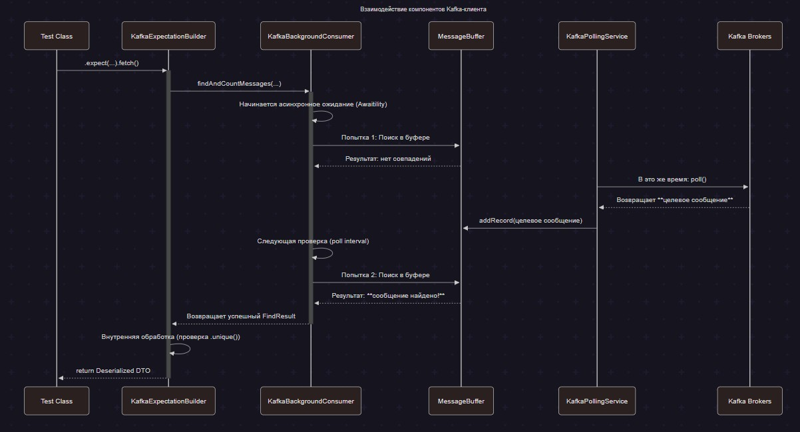
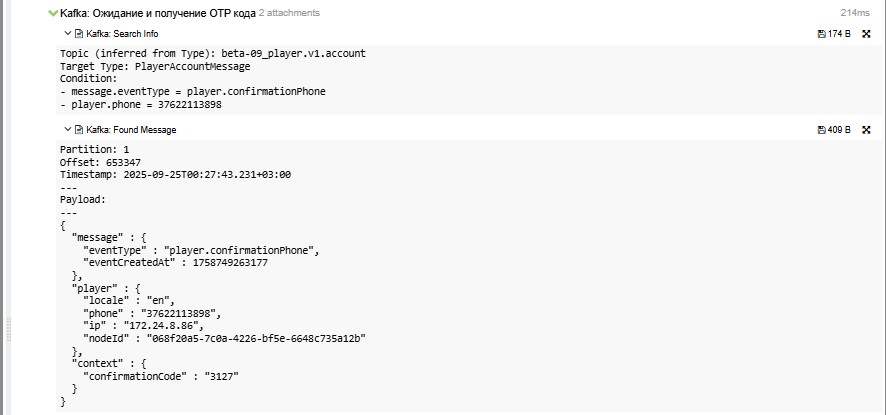

# Kafka Test Client

Kafka-клиент из модуля `kafka-api` помогает автотестам находить события в нужных топиках, ждать их появления и
прикладывать подробные артефакты в Allure. Он работает асинхронно, потокобезопасен и интегрируется со Spring Boot
через стандартные бины конфигурации.

## Оглавление

- [Kafka Test Client](#kafka-test-client)
  - [Архитектура](#архитектура)
  - [Подключение и конфигурация](#подключение-и-конфигурация)
    - [DTO и сопоставление топиков](#dto-и-сопоставление-топиков)
    - [Зависимость Gradle](#зависимость-gradle)
    - [Spring-конфигурация реестра топиков](#spring-конфигурация-реестра-топиков)
    - [Настройки приложения](#настройки-приложения)
  - [Сценарии использования](#сценарии-использования)
    - [Методы fluent API](#методы-fluent-api)
    - [Комплексный пример](#комплексный-пример)
  - [Интеграция с Allure](#интеграция-с-allure)
- [NATS Test Client](#nats-test-client)
  - [Архитектура и ключевые компоненты](#архитектура-и-ключевые-компоненты)
  - [Подключение и конфигурация](#подключение-и-конфигурация-1)
    - [Зависимость Gradle](#зависимость-gradle-1)
    - [Файл окружения](#файл-окружения)
    - [Настройки клиента](#настройки-клиента)
  - [Сценарии использования](#сценарии-использования-1)
    - [Методы fluent API](#методы-fluent-api-1)
    - [Комплексный пример](#комплексный-пример-1)
  - [Интеграция с Allure](#интеграция-с-allure-1)
- [Redis Test Client](#redis-test-client)
  - [Основные возможности](#основные-возможности-1)
  - [Конфигурация Spring](#конфигурация-spring)
  - [Конфигурация приложения](#конфигурация-приложения)
  - [Руководство по использованию](#руководство-по-использованию-1)
- [Материалы для визуализаций](#материалы-для-визуализаций)

## Архитектура

Высокоуровневый обмен между тестом, клиентом и Kafka выглядит так:



---

## Подключение и конфигурация

Чтобы подключить Kafka-клиент в тестовом проекте:

1. Добавьте модуль `kafka-api` в тестовые зависимости Gradle.
2. Опишите DTO для сообщений и зарегистрируйте сопоставление DTO → топик в `KafkaTopicMappingRegistry`.
3. Настройте параметры Kafka в окруженческих JSON-файлах.

### DTO и сопоставление топиков

Создайте `record`, который отражает схему сообщения и будет десериализовываться клиентом:

```java
package com.uplatform.wallet_tests.api.kafka.dto;

public record BonusAwardMessage(
        String playerId,
        String bonusId,
        String status,
        long sequence
) {}
```

Затем зарегистрируйте DTO в `KafkaTopicMappingRegistry`, чтобы фоновые listener'ы подписались на нужный топик (см.
пример ниже).

### Зависимость Gradle

Добавьте модуль в тестовые зависимости:

```gradle
dependencies {
    testImplementation project(":kafka-api")
}
```

### Spring-конфигурация реестра топиков

Создайте бин `KafkaTopicMappingRegistry`, который сопоставляет DTO и суффиксы топиков:

```java
@Configuration
public class KafkaConsumerConfig {

    @Bean
    public KafkaTopicMappingRegistry kafkaTopicMappingRegistry() {
        Map<Class<?>, String> mappings = new HashMap<>();
        mappings.put(BonusAwardMessage.class, "bonus.v1.award");
        // другие сопоставления
        return new SimpleKafkaTopicMappingRegistry(mappings);
    }
}
```

Реестр гарантирует, что фоновые listener'ы подпишутся на каждый указанный топик автоматически — ничего дополнительно
в `application.yml` прописывать не нужно.

### Настройки приложения

Фрагмент `configs/local.json`, который покрывает основные параметры клиента:

```json
{
  "kafka": {
    "bootstrapServer": "kafka-development-01:9092,kafka-development-02:9092,kafka-development-03:9092",
    "groupId": "wallet-tests-consumer",
    "bufferSize": 500,
    "findMessageTimeout": "PT60S",
    "findMessageSleepInterval": "PT0.2S",
    "pollDuration": "PT1S",
    "shutdownTimeout": "PT5S",
    "autoOffsetReset": "latest",
    "enableAutoCommit": true
  }
}
```

Все параметры читаются через `KafkaProperties` и автоматически прокидываются в `KafkaClient` через Spring. Изменяйте их
в JSON-конфигах окружений, чтобы не править код при переключении между стендами.

- `topicPrefix` задаётся в `EnvironmentConfig.topicPrefix`. Добавляется ко всем Kafka-топикам, например `wallet.beta.`.
- `bootstrapServer` в блоке `kafka.bootstrapServer` перечисляет брокеры, к которым подключается consumer: `kafka-dev-01:9092,kafka-dev-02:9092`.
- `groupId` (`kafka.groupId`) — идентификатор consumer group для всех автотестов, например `wallet-tests-consumer`.
- `bufferSize` (`kafka.bufferSize`) ограничивает количество сообщений на топик в буфере. Типичное значение — `500`.
- `findMessageTimeout` (`kafka.findMessageTimeout`) задаёт таймаут ожидания для `fetch()` по умолчанию, например `PT20S`.
- `findMessageSleepInterval` (`kafka.findMessageSleepInterval`) определяет паузу между попытками поиска сообщения, например `PT0.2S`.
- `pollDuration` (`kafka.pollDuration`) описывает максимальную блокировку вызова `poll` у consumer'а, обычно `PT1S`.
- `shutdownTimeout` (`kafka.shutdownTimeout`) — время на корректное завершение consumer при остановке тестов, например `PT5S`.
- `autoOffsetReset` (`kafka.autoOffsetReset`) регулирует поведение при отсутствии offset'ов (`latest` или `earliest`).
- `enableAutoCommit` (`kafka.enableAutoCommit`) включает автоматический коммит offset'ов, чаще всего `true`.

## Сценарии использования

### Методы fluent API

- `kafkaClient.expect(Class<T>)` — вызывается на бине `KafkaClient`, стартует построение ожидания для указанного DTO и
  подхватывает таймаут по умолчанию из конфигурации.
- `.with(String key, Object value)` — вызывается на билдере, добавляет JsonPath-фильтр. Значение сериализуется в `String`,
  `null` и пустые строки игнорируются, вложенные поля описываются как `data.player.id` или `$.path.to.field`.
- `.unique()` — включает проверку уникальности события в буфере. При нарушении будет выброшено
  `KafkaMessageNotUniqueException`, при отсутствии подходящего сообщения — `KafkaMessageNotFoundException`.
- `.within(Duration timeout)` — переопределяет таймаут ожидания только для текущего запроса. Подходит для ускоренных или
  долгих сценариев без изменения глобальной настройки.
- `.fetch()` — выполняет поиск сообщения и возвращает десериализованный DTO, формируя Allure-аттачи даже при таймауте или
  ошибке десериализации.

Комбинируйте методы цепочкой, чтобы описать нужное ожидание. Фильтры применяются одновременно, поэтому событие должно
удовлетворять всем заданным условиям.

### Комплексный пример

```java
step("Kafka: Получение сообщения из топика limits.v2", () -> {
    var expectedAmount = initialAmount.stripTrailingZeros().toPlainString();
    LimitMessage kafkaLimitMessage = kafkaClient.expect(LimitMessage.class)
            .with("playerId", registeredPlayer.getWalletData().playerUUID())
            .with("limitType", NatsLimitType.SINGLE_BET.getValue())
            .with("currencyCode", registeredPlayer.getWalletData().currency())
            .with("amount", expectedAmount)
            .fetch();

    assertNotNull(kafkaLimitMessage, "kafka.limits_v2_event.message_not_null");
});
```

Комбинируйте `.unique()` и `within(...)`, чтобы гибко управлять проверками и таймаутами.

---

## Интеграция с Allure

При каждом поиске клиент формирует аттачи:

- **Search Info** — условия поиска (топик, DTO, фильтры, таймаут).
- **Found Message** — форматированное тело найденного события, partition, offset и timestamp.
- **Message Not Found** — отчёт о таймауте и несостоявшемся поиске.
- **Deserialization Error** — подробности ошибки Jackson и исходный payload.

Пример того, как это выглядит в Allure:

---

## NATS Test Client

Клиент NATS в модуле `kafka-api` работает поверх JetStream, повторяя знакомый по Kafka и Redis подход: ожидания описываются через
fluent API, параметры читаются из единого JSON-конфига, а результат сопровождается аттачами в Allure.

### Архитектура и ключевые компоненты

- **`NatsClient`.** Фасад, который собирает ожидание (`expect(...)`) и делегирует поиск в `NatsSubscriber`.
- **`NatsSubscriber`.** Управляет JetStream-подпиской в отдельном dispatcher'е, применяет фильтры и следит за таймаутами.
- **`NatsPayloadMatcher`.** Сравнивает payload по JSONPath-выражениям и метаданным сообщения.
- **`NatsAttachmentHelper`.** Формирует единый набор аттачей: Search Info, Found Message, Duplicate Message и Message Not Found.
- **`NatsConnectionManager`.** Настраивает подключение и кэширует `Connection`/`JetStream` на время тестового прогона.

Такое разделение повторяет паттерн Kafka-клиента, поэтому интеграция с тестами и Spring остаётся однородной.

### Подключение и конфигурация

#### Зависимость Gradle

```gradle
dependencies {
    testImplementation project(":kafka-api")
}
```

#### Файл окружения

`EnvironmentConfigurationProvider` читает JSON `configs/<env>.json` (значение передаётся через `-Denv=...`) и прокидывает блок
`nats` в `NatsConfigProvider`:

```json
{
  "name": "beta",
  "natsStreamPrefix": "beta_",
  "nats": {
    "hosts": ["nats://nats-1:4222", "nats://nats-2:4222"],
    "streamName": "wallet-events",
    "subscriptionRetryCount": 3,
    "subscriptionRetryDelayMs": 500,
    "connectReconnectWaitSeconds": 2,
    "connectMaxReconnects": 10,
    "searchTimeoutSeconds": 30,
    "subscriptionAckWaitSeconds": 5,
    "subscriptionInactiveThresholdSeconds": 60,
    "subscriptionBufferSize": 256,
    "uniqueDuplicateWindowMs": 400,
    "failOnDeserialization": true
  }
}
```

Полное имя стрима формируется как `natsStreamPrefix + streamName`; хелпер `buildWalletSubject(...)` дополнительно добавляет
окруженческий префикс и wildcard-сегмент для канала.

#### Настройки клиента

- `hosts` (`nats.hosts`) — список URL JetStream-кластера, к которым подключается клиент.
- `streamName` (`nats.streamName`) — базовое имя стрима без окруженческого префикса; окружение добавляется через `natsStreamPrefix`.
- `subscriptionRetryCount` / `subscriptionRetryDelayMs` (`nats.subscriptionRetryCount` / `nats.subscriptionRetryDelayMs`) — количество попыток создания подписки и пауза между ними.
- `connectReconnectWaitSeconds` / `connectMaxReconnects` (`nats.connectReconnectWaitSeconds` / `nats.connectMaxReconnects`) — стратегия переподключений при потере соединения.
- `searchTimeoutSeconds` (`nats.searchTimeoutSeconds`) — таймаут ожидания сообщения по умолчанию; метод `.within(...)` переопределяет его локально.
- `subscriptionAckWaitSeconds` / `subscriptionInactiveThresholdSeconds` (`nats.subscriptionAckWaitSeconds` / `nats.subscriptionInactiveThresholdSeconds`) — таймауты ack и неактивности JetStream-подписки.
- `subscriptionBufferSize` (`nats.subscriptionBufferSize`) — размер буфера сообщений на подписку в памяти клиента.
- `uniqueDuplicateWindowMs` (`nats.uniqueDuplicateWindowMs`) — окно, в пределах которого работает контроль дублей для `.unique()`.
- `failOnDeserialization` (`nats.failOnDeserialization`) — при значении `true` ожидание завершается ошибкой, если payload нельзя десериализовать.

## Сценарии использования

### Методы fluent API

NATS-DSL полностью перешёл на JSONPath- и metadata-фильтры, повторяя подход Kafka-клиента и делая поиск сообщений детерминированным.

- `natsClient.expect(Class<T>)` — стартует построение ожидания для DTO и подхватывает таймаут по умолчанию из конфигурации.
- `.from(String subject)` — задаёт subject JetStream, с которого нужно читать события. Хелпер `buildWalletSubject(...)` помогает формировать его из идентификаторов игрока/кошелька.
- `.with(String jsonPath, Object value)` — добавляет JSONPath-фильтр к payload. Значение сериализуется в строку; `null` и пустые строки игнорируются. Можно комбинировать выражения любой вложенности: `$.playerId`, `$.data.limit.amount`, `data.balance`.
- `.withType(String type)` — проверяет metadata-поле `type`, удобно для разграничения событий одного DTO.
- `.withSequence(long sequence)` — фиксирует ожидаемый порядковый номер сообщения в стриме.
- `.unique()` — включает контроль дублей, используя окно `uniqueDuplicateWindowMs` из конфигурации.
- `.unique(Duration window)` — задаёт собственное окно для поиска дублей; повторяющиеся сообщения приводят к `NatsDuplicateMessageException` и отдельному аттачу.
- `.within(Duration timeout)` — переопределяет таймаут ожидания только для текущего запроса.
- `.fetch()` — выполняет поиск сообщения, возвращает `NatsMessage<T>` и формирует аттачи даже при таймауте или ошибке.

Все фильтры применяются одновременно, поэтому сообщение должно удовлетворять каждому условию сразу.

### Комплексный пример

```java
step("NATS: Получаем событие о создании лимита", () -> {
    String subject = natsClient.buildWalletSubject(playerId.toString(), walletId.toString());

    NatsMessage<WalletLimitEvent> message = natsClient.expect(WalletLimitEvent.class)
            .from(subject)
            .with("$.playerId", playerId.toString())
            .with("$.limitType", expectedLimitType)
            .withType("LimitCreatedEvent")
            .withSequence(expectedSequence)
            .unique(Duration.ofSeconds(5))
            .within(Duration.ofSeconds(30))
            .fetch();

    assertThat(message.getPayload().limitType()).isEqualTo(expectedLimitType);
});
```

Комбинируйте `.unique()` и `within(...)`, чтобы гибко управлять таймаутами и проверкой дублей.

### Интеграция с Allure

Каждый поиск формирует единый набор вложений:

- **Search Info** — subject, таймаут, тип DTO и полный список JSONPath/metadata-фильтров.
- **Found Message** — форматированный payload с метаданными JetStream.
- **Duplicate Message** — появляется при нарушении `.unique()`.
- **Message Not Found** — содержит информацию о таймауте и применённых фильтрах.

---

## Redis Test Client

Redis-клиент из `kafka-api` помогает автотестам проверять JSON-структуры в Redis с поддержкой JsonPath-фильтров и Allure-аттачей.

### Основные возможности

- **Fluent API.** Цепочка `key(...).with(...).withAtLeast(...).within(...).fetch()` знакома по Kafka-клиенту.
- **JsonPath-фильтры.** Проверяют значения любой глубины вложенности.
- **Гибкий ретрай.** Интервалы и количество попыток управляются в конфигурации `redis.aggregate`.
- **Типобезопасные DTO.** Ответ десериализуется в типы, зарегистрированные в `RedisTypeMappingRegistry`.
- **Allure-интеграция.** Каждый вызов сопровождается информативными вложениями.

### Конфигурация Spring

Опишите бин `RedisTypeMappingRegistry`, который связывает имена клиентов с `TypeReference` нужного DTO:

```java
@Configuration
public class RedisConfig {

    @Bean
    public RedisTypeMappingRegistry redisTypeMappingRegistry() {
        return new RedisTypeMappingRegistry()
                .register("wallet", new TypeReference<WalletFullData>() {})
                .register("player", new TypeReference<Map<String, WalletData>>() {});
    }
}
```

Каждый клиент из конфигурации разворачивается в бин `redis<Имя>Client`. Например, `clients.wallet` создаёт `redisWalletClient`.

### Конфигурация приложения

Блок `redis` в `application.yml` или окруженческом JSON содержит настройки ретраев и подключений:

```yaml
redis:
  aggregate:
    maxGamblingCount: 50
    maxIframeCount: 500
    retryAttempts: 20
    retryDelayMs: 500
  clients:
    wallet:
      host: redis-01.b2bdev.pro
      port: 6390
      database: 9
      timeout: 5000ms
      password: secret # опционально
      lettucePool:
        maxActive: 8
        maxIdle: 8
        minIdle: 0
        maxWait: 2s
        shutdownTimeout: 100ms
    player:
      host: redis-01.b2bdev.pro
      port: 6389
      database: 9
      timeout: 5s
```

| Параметр | Назначение |
| --- | --- |
| `aggregate.retryAttempts` / `aggregate.retryDelayMs` | Количество повторов чтения и пауза между ними. |
| `aggregate.maxGamblingCount` / `aggregate.maxIframeCount` | Границы агрегатов, используемые тестами. |
| `clients.<name>` | Подключение к конкретному Redis-инстансу и имя создаваемого бина `redis<Имя>Client`. |
| `timeout` | Таймаут операций Lettuce (поддерживаются ISO 8601 и единицы с суффиксом `ms`). |
| `password` | Опциональный пароль для подключения. |
| `lettucePool.*` | Параметры пула соединений: лимиты активных/свободных коннектов, ожидание и завершение. |

### Руководство по использованию

**Проверка агрегата кошелька.**

```java
step("Redis(Wallet): Проверяем агрегат кошелька", () -> {
    WalletFullData aggregate = redisWalletClient.key("wallet:aggregate:" + playerId)
            .with("$.playerId", playerId)
            .withAtLeast("$.balances.main", BigDecimal.ZERO)
            .fetch();

    assertAll("Поля агрегата кошелька",
            () -> assertEquals(playerId, aggregate.playerId(), "then.redis.wallet.player_id"),
            () -> assertTrue(aggregate.balances().main().compareTo(BigDecimal.ZERO) >= 0, "then.redis.wallet.balance.non_negative")
    );
});
```

**Чтение связанных кошельков с пользовательским таймаутом.**

```java
step("Redis(Player): Считываем список кошельков с пользовательским таймаутом", () -> {
    Map<String, WalletData> wallets = redisPlayerClient.key("player:wallets:" + playerId)
            .with("$.metadata.environment", "beta-09")
            .within(Duration.ofSeconds(15))
            .fetch();

    assertNotNull(wallets.get(playerId), "then.redis.player.wallet_present");
});
```

Метод `key` стартует билдер для конкретного ключа, `with` и `withAtLeast` проверяют значения через JsonPath, а `within` переопределяет
таймаут. При истечении времени выбрасывается `RedisRetryExhaustedException` с подробными аттачами.

---

## Материалы для визуализаций

- `docs/images/kafka-architecture-diagram.png` — путь для PNG/WEBP диаграммы, экспортированной из Mermaid-сценария выше.
- `docs/images/allure-report-example.png` — путь для скриншота отчёта Allure с аттачами Kafka.

Храните файлы в каталоге `docs/images` в корне репозитория и подключайте их из README через относительный путь
`../docs/images/<filename>`.
