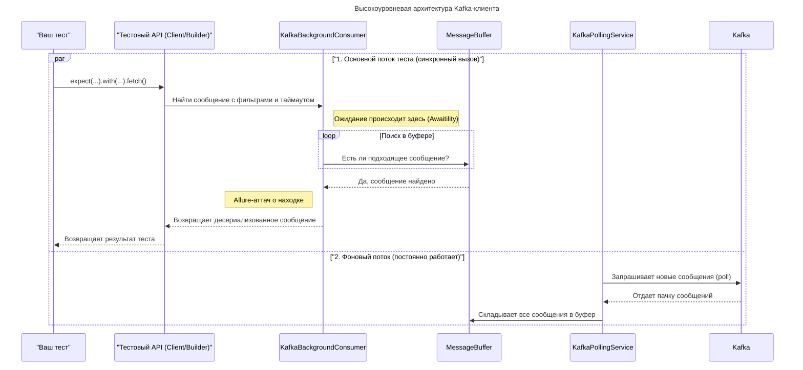

# Kafka Test Client

Kafka-клиент из модуля `kafka-api` помогает автотестам находить события в нужных топиках, ждать их появления и
прикладывать подробные артефакты в Allure. Он работает асинхронно, потокобезопасен и интегрируется со Spring Boot
через стандартные бины конфигурации.

## Оглавление

- [Kafka Test Client](#kafka-test-client)
  - [Архитектура](#архитектура)
- [Подключение и конфигурация](#подключение-и-конфигурация)
  - [Зависимость Gradle](#зависимость-gradle)
  - [Spring-конфигурация реестра топиков](#spring-конфигурация-реестра-топиков)
  - [Настройки приложения](#настройки-приложения)
  - [Описываем DTO](#описываем-dto)
- [Сценарии использования](#сценарии-использования)
  - [Методы fluent API](#методы-fluent-api)
  - [Комплексный пример](#комплексный-пример)
- [Интеграция с Allure](#интеграция-с-allure)
- [NATS Test Client](#nats-test-client)
  - [Основные возможности](#основные-возможности)
  - [Конфигурация](#конфигурация)
  - [Руководство по использованию](#руководство-по-использованию)
- [Redis Test Client](#redis-test-client)
  - [Основные возможности](#основные-возможности-1)
  - [Конфигурация Spring](#конфигурация-spring)
  - [Конфигурация приложения](#конфигурация-приложения)
  - [Руководство по использованию](#руководство-по-использованию-1)
- [Материалы для визуализаций](#материалы-для-визуализаций)

---

## Архитектура

Высокоуровневый обмен между тестом, клиентом и Kafka выглядит так:

_Заглушка под диаграмму: сохраните экспортированный PNG как_
`docs/images/kafka-architecture-diagram.png` _и подключите его через синтаксис_

```

```

<details>
<summary>Mermaid-код диаграммы</summary>



Сохраните этот код во временный файл `docs/images/kafka-architecture-diagram.mmd` (файл не хранится в
репозитории) и выполните локально команду
`mmdc -p mermaid-puppeteer-config.json -i docs/images/kafka-architecture-diagram.mmd -o docs/images/kafka-architecture-diagram.png`,
чтобы сгенерировать PNG для README.

</details>

---

## Подключение и конфигурация

Чтобы подключить Kafka-клиент в тестовом проекте, выполните шаги ниже:

1. Добавьте модуль `kafka-api` в тестовые зависимости Gradle.
2. Зарегистрируйте сопоставление DTO → топик в `KafkaTopicMappingRegistry`.
3. Настройте параметры Kafka в окруженческих JSON-файлах.
4. Опишите DTO, которые будут десериализоваться из сообщений.

### Зависимость Gradle

Добавьте модуль в тестовые зависимости:

```gradle
dependencies {
    testImplementation project(":kafka-api")
}
```

### Spring-конфигурация реестра топиков

Создайте бин `KafkaTopicMappingRegistry`, который сопоставляет DTO и суффиксы топиков:

```java
@Configuration
public class KafkaConsumerConfig {

    @Bean
    public KafkaTopicMappingRegistry kafkaTopicMappingRegistry() {
        Map<Class<?>, String> mappings = new HashMap<>();
        mappings.put(BonusAwardMessage.class, "bonus.v1.award");
        // другие сопоставления
        return new SimpleKafkaTopicMappingRegistry(mappings);
    }
}
```

Реестр гарантирует, что фоновые listener'ы подпишутся на каждый указанный топик автоматически — ничего дополнительно
в `application.yml` прописывать не нужно.

### Настройки приложения

Фрагмент `configs/local.json`, который покрывает основные параметры клиента:

```json
{
  "kafka": {
    "bootstrapServer": "kafka-development-01:9092,kafka-development-02:9092,kafka-development-03:9092",
    "groupId": "wallet-tests-consumer",
    "bufferSize": 500,
    "findMessageTimeout": "PT60S",
    "findMessageSleepInterval": "PT0.2S",
    "pollDuration": "PT1S",
    "shutdownTimeout": "PT5S",
    "autoOffsetReset": "latest",
    "enableAutoCommit": true
  }
}
```

Все параметры читаются через `KafkaProperties` и попадают в `KafkaClient`. Изменяйте их в JSON-конфигах окружений,
чтобы не править код при переключении между стендами.

| Параметр | Где задаётся | Назначение | Пример |
| --- | --- | --- | --- |
| `topicPrefix` | `EnvironmentConfig.topicPrefix` | Префикс окружения, добавляется ко всем Kafka-топикам. | `wallet.beta.` |
| `bootstrapServer` | `kafka.bootstrapServer` | Список брокеров, к которым подключается consumer. | `kafka-dev-01:9092,kafka-dev-02:9092` |
| `groupId` | `kafka.groupId` | Идентификатор consumer group для всех автотестов. | `wallet-tests-consumer` |
| `bufferSize` | `kafka.bufferSize` | Максимум сообщений на топик, хранимых в буфере. | `500` |
| `findMessageTimeout` | `kafka.findMessageTimeout` | Таймаут ожидания в методе `fetch()` по умолчанию. | `PT20S` |
| `findMessageSleepInterval` | `kafka.findMessageSleepInterval` | Интервал между попытками поиска подходящего сообщения. | `PT0.2S` |
| `pollDuration` | `kafka.pollDuration` | Максимальная блокировка вызова `poll`. | `PT1S` |
| `shutdownTimeout` | `kafka.shutdownTimeout` | Время на корректное завершение consumer при остановке тестов. | `PT5S` |
| `autoOffsetReset` | `kafka.autoOffsetReset` | Поведение при отсутствии offset'ов (`latest`/`earliest`). | `latest` |
| `enableAutoCommit` | `kafka.enableAutoCommit` | Управляет автоматическим коммитом offset'ов. | `true` |

### Описываем DTO

Kafka-клиент десериализует сообщения в классы, зарегистрированные в `KafkaTopicMappingRegistry`. DTO можно объявлять
через `record`, чтобы Jackson автоматически сопоставил поля:

```java
package com.uplatform.wallet_tests.api.kafka.dto;

public record BonusAwardMessage(
        String playerId,
        String bonusId,
        String status,
        long sequence
) {}
```

После добавления нового типа не забудьте зарегистрировать его суффикс в реестре топиков (см. раздел выше) — тогда
фоновые консьюмеры автоматически начнут слушать нужный топик.

---

## Сценарии использования

### Методы fluent API

| Метод | Где вызывается | Что делает | Примечания |
| --- | --- | --- | --- |
| `kafkaClient.expect(Class<T>)` | На бине `KafkaClient` | Стартует построение ожидания для указанного DTO. | Получает дефолтный таймаут из конфигурации. |
| `.with(String key, Object value)` | На билдере | Добавляет JsonPath-фильтр. Значение сериализуется в `String`. | `null` и пустые значения пропускаются, вложенность описывается `data.player.id` или `$.path.to.field`. |
| `.unique()` | На билдере | Включает проверку уникальности события в буфере. | При нарушении бросит `KafkaMessageNotUniqueException`; при отсутствии — `KafkaMessageNotFoundException`. |
| `.within(Duration timeout)` | На билдере | Переопределяет таймаут ожидания только для текущего запроса. | Полезно для быстрых/долгих сценариев без смены глобальной настройки. |
| `.fetch()` | На билдере | Запускает поиск сообщения и возвращает десериализованный DTO. | Создаёт Allure-аттачи, в том числе при таймауте. |

Комбинируйте методы цепочкой, чтобы описать нужное ожидание. Фильтры применяются одновременно, поэтому событие должно
удовлетворять всем заданным условиям.

### Комплексный пример

```java
step("Kafka: Получение сообщения из топика limits.v2", () -> {
    var expectedAmount = initialAmount.stripTrailingZeros().toPlainString();
    LimitMessage kafkaLimitMessage = kafkaClient.expect(LimitMessage.class)
            .with("playerId", registeredPlayer.getWalletData().playerUUID())
            .with("limitType", NatsLimitType.SINGLE_BET.getValue())
            .with("currencyCode", registeredPlayer.getWalletData().currency())
            .with("amount", expectedAmount)
            .fetch();

    assertNotNull(kafkaLimitMessage, "kafka.limits_v2_event.message_not_null");
});
```

Комбинируйте `.unique()` и `within(...)`, чтобы гибко управлять проверками и таймаутами.

---

## Интеграция с Allure

При каждом поиске клиент формирует аттачи:

- **Search Info** — условия поиска (топик, DTO, фильтры, таймаут).
- **Found Message** — форматированное тело найденного события, partition, offset и timestamp.
- **Message Not Found** — отчёт о таймауте и несостоявшемся поиске.
- **Deserialization Error** — подробности ошибки Jackson и исходный payload.

Пример того, как это выглядит в Allure:

_Заглушка под скриншот: сохраните изображение как_
`docs/images/allure-report-example.png` _и подключите его через синтаксис_

```

```

Скриншот должен отражать стандартный набор аттачей клиента и храниться локально в `docs/images/allure-report-example.png` перед
публикацией.

---

## NATS Test Client

Клиент NATS из модуля `kafka-api` помогает автотестам получать события JetStream, фильтровать их и прикладывать артефакты в
Allure.

### Основные возможности

- **Fluent API.** Цепочка `expect(...).from(...).with(...).unique().within(...).fetch()` позволяет гибко описывать ожидания.
- **Асинхронное ожидание.** Клиент создаёт подписку в отдельном dispatcher'е JetStream и автоматически возобновляет её при
  ошибках.
- **Контроль дублей.** Метод `unique()` отслеживает повторные события в окне `uniqueDuplicateWindowMs` и добавляет Allure-аттачи
  при нарушении.
- **Готовые subject-builder'ы.** Вспомогательные методы, такие как `buildWalletSubject(...)`, генерируют шаблоны с учётом
  окруженческого префикса.

### Конфигурация

**Файл окружения.** `EnvironmentConfigurationProvider` читает JSON `configs/<env>.json` (указывается через `-Denv=...`) и
передаёт блок `nats` в `NatsConfigProvider`:

```json
{
  "name": "beta",
  "natsStreamPrefix": "beta_",
  "nats": {
    "hosts": ["nats://nats-1:4222", "nats://nats-2:4222"],
    "streamName": "wallet-events",
    "subscriptionRetryCount": 3,
    "subscriptionRetryDelayMs": 500,
    "connectReconnectWaitSeconds": 2,
    "connectMaxReconnects": 10,
    "searchTimeoutSeconds": 30,
    "subscriptionAckWaitSeconds": 5,
    "subscriptionInactiveThresholdSeconds": 60,
    "subscriptionBufferSize": 256,
    "uniqueDuplicateWindowMs": 400,
    "failOnDeserialization": true
  }
}
```

| Параметр | Назначение |
| --- | --- |
| `hosts` | URL JetStream-кластера для подключения. |
| `streamName` | Базовое имя стрима без окруженческого префикса. |
| `subscriptionRetryCount` / `subscriptionRetryDelayMs` | Количество попыток создать подписку и задержка между ними. |
| `connectReconnectWaitSeconds` / `connectMaxReconnects` | Повторные подключения клиента к NATS. |
| `searchTimeoutSeconds` | Таймаут ожидания сообщения по умолчанию. |
| `subscriptionAckWaitSeconds` / `subscriptionInactiveThresholdSeconds` | Таймауты ack и неактивности JetStream-подписки. |
| `subscriptionBufferSize` | Размер буфера полученных сообщений. |
| `uniqueDuplicateWindowMs` | Окно контроля дублей при использовании `unique()`. |
| `failOnDeserialization` | Если `true`, клиент падает при ошибке десериализации payload. |

Полное имя стрима вычисляется как `natsStreamPrefix + streamName`, где префикс берётся из имени окружения.

### Руководство по использованию

**Поиск события по subject.**

```java
NatsMessage<WalletLimitEvent> message = natsClient.expect(WalletLimitEvent.class)
        .from(natsClient.buildWalletSubject(playerId.toString(), walletId.toString()))
        .with((payload, type) -> payload.getPlayerId().equals(playerId))
        .fetch();
```

Метод `from` задаёт subject подписки, `with` принимает `BiPredicate` с payload и type header (если он задан).

**Контроль уникальности события.**

```java
NatsMessage<WalletLimitEvent> message = natsClient.expect(WalletLimitEvent.class)
        .from(subject)
        .unique(Duration.ofSeconds(5))
        .fetch();
```

`unique(Duration)` ограничивает окно поиска дублей. Повторное событие в пределах окна вызывает `NatsDuplicateMessageException`
и отдельный Allure-аттач.

**Асинхронный сценарий.**

```java
CompletableFuture<NatsMessage<WalletLimitEvent>> future = natsClient.expect(WalletLimitEvent.class)
        .from(subject)
        .within(Duration.ofSeconds(20))
        .fetchAsync();

// ... действия теста ...

NatsMessage<WalletLimitEvent> message = future.join();
```

`fetchAsync()` возвращает `CompletableFuture`, который завершится найденным сообщением или таймаутом.

---

## Redis Test Client

Redis-клиент из `kafka-api` помогает автотестам проверять JSON-структуры в Redis с поддержкой JsonPath-фильтров и Allure-аттачей.

### Основные возможности

- **Fluent API.** Цепочка `key(...).with(...).withAtLeast(...).within(...).fetch()` знакома по Kafka-клиенту.
- **JsonPath-фильтры.** Проверяют значения любой глубины вложенности.
- **Гибкий ретрай.** Интервалы и количество попыток управляются в конфигурации `redis.aggregate`.
- **Типобезопасные DTO.** Ответ десериализуется в типы, зарегистрированные в `RedisTypeMappingRegistry`.
- **Allure-интеграция.** Каждый вызов сопровождается информативными вложениями.

### Конфигурация Spring

Опишите бин `RedisTypeMappingRegistry`, который связывает имена клиентов с `TypeReference` нужного DTO:

```java
@Configuration
public class RedisConfig {

    @Bean
    public RedisTypeMappingRegistry redisTypeMappingRegistry() {
        return new RedisTypeMappingRegistry()
                .register("wallet", new TypeReference<WalletFullData>() {})
                .register("player", new TypeReference<Map<String, WalletData>>() {});
    }
}
```

Каждый клиент из конфигурации разворачивается в бин `redis<Имя>Client`. Например, `clients.wallet` создаёт `redisWalletClient`.

### Конфигурация приложения

Блок `redis` в `application.yml` или окруженческом JSON содержит настройки ретраев и подключений:

```yaml
redis:
  aggregate:
    maxGamblingCount: 50
    maxIframeCount: 500
    retryAttempts: 20
    retryDelayMs: 500
  clients:
    wallet:
      host: redis-01.b2bdev.pro
      port: 6390
      database: 9
      timeout: 5000ms
      password: secret # опционально
      lettucePool:
        maxActive: 8
        maxIdle: 8
        minIdle: 0
        maxWait: 2s
        shutdownTimeout: 100ms
    player:
      host: redis-01.b2bdev.pro
      port: 6389
      database: 9
      timeout: 5s
```

| Параметр | Назначение |
| --- | --- |
| `aggregate.retryAttempts` / `aggregate.retryDelayMs` | Количество повторов чтения и пауза между ними. |
| `aggregate.maxGamblingCount` / `aggregate.maxIframeCount` | Границы агрегатов, используемые тестами. |
| `clients.<name>` | Подключение к конкретному Redis-инстансу и имя создаваемого бина `redis<Имя>Client`. |
| `timeout` | Таймаут операций Lettuce (поддерживаются ISO 8601 и единицы с суффиксом `ms`). |
| `password` | Опциональный пароль для подключения. |
| `lettucePool.*` | Параметры пула соединений: лимиты активных/свободных коннектов, ожидание и завершение. |

### Руководство по использованию

**Проверка агрегата кошелька.**

```java
step("Redis(Wallet): Проверяем агрегат кошелька", () -> {
    WalletFullData aggregate = redisWalletClient.key("wallet:aggregate:" + playerId)
            .with("$.playerId", playerId)
            .withAtLeast("$.balances.main", BigDecimal.ZERO)
            .fetch();

    assertAll("Поля агрегата кошелька",
            () -> assertEquals(playerId, aggregate.playerId(), "then.redis.wallet.player_id"),
            () -> assertTrue(aggregate.balances().main().compareTo(BigDecimal.ZERO) >= 0, "then.redis.wallet.balance.non_negative")
    );
});
```

**Чтение связанных кошельков с пользовательским таймаутом.**

```java
step("Redis(Player): Считываем список кошельков с пользовательским таймаутом", () -> {
    Map<String, WalletData> wallets = redisPlayerClient.key("player:wallets:" + playerId)
            .with("$.metadata.environment", "beta-09")
            .within(Duration.ofSeconds(15))
            .fetch();

    assertNotNull(wallets.get(playerId), "then.redis.player.wallet_present");
});
```

Метод `key` стартует билдер для конкретного ключа, `with` и `withAtLeast` проверяют значения через JsonPath, а `within` переопределяет
таймаут. При истечении времени выбрасывается `RedisRetryExhaustedException` с подробными аттачами.

---

## Материалы для визуализаций

- `docs/images/kafka-architecture-diagram.png` — путь для PNG/WEBP диаграммы, экспортированной из Mermaid-сценария выше.
- `docs/images/allure-report-example.png` — путь для скриншота отчёта Allure с аттачами Kafka.

Храните файлы в каталоге `docs/images` в корне репозитория и подключайте их из README через относительный путь
`../docs/images/<filename>`.
