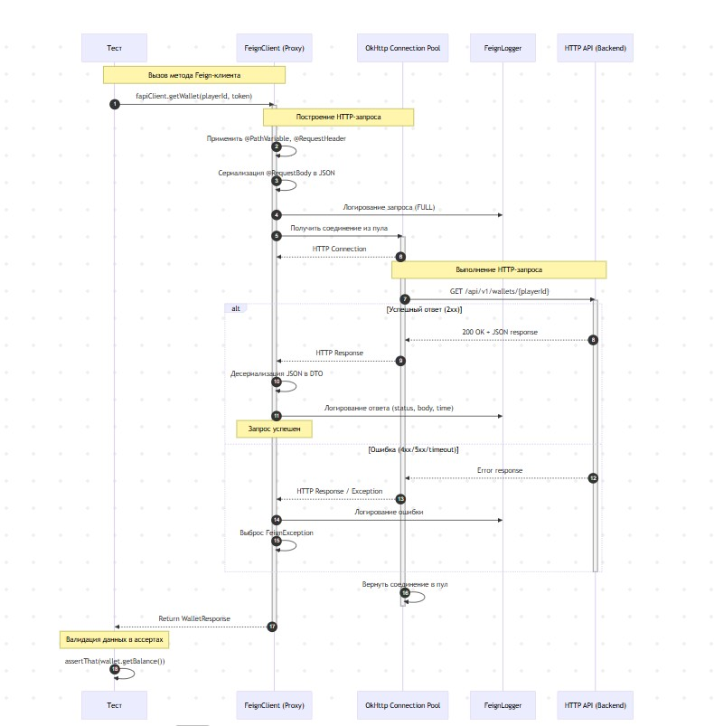
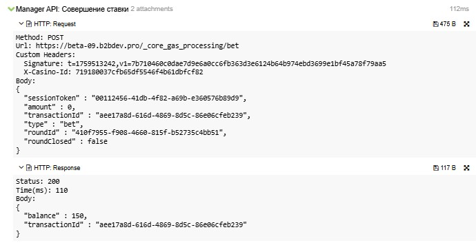
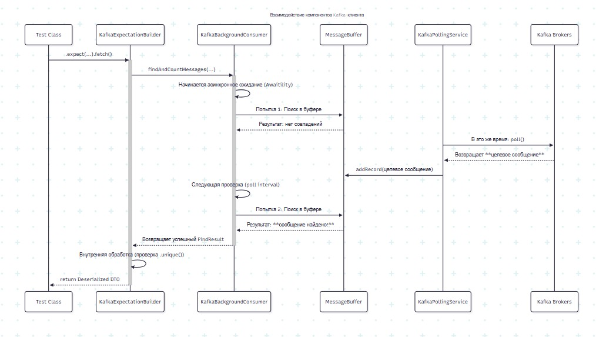
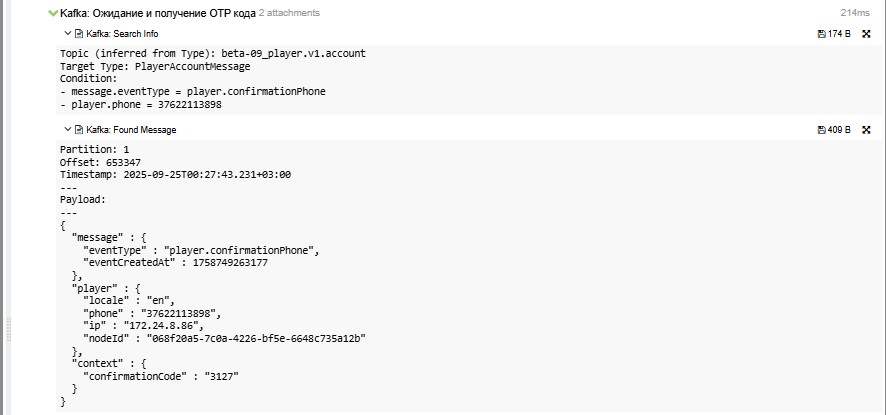
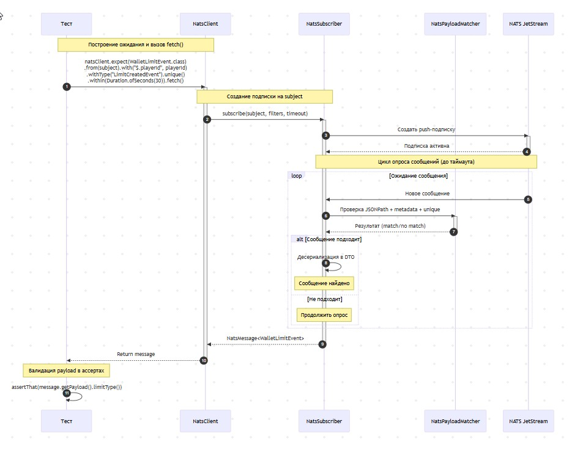
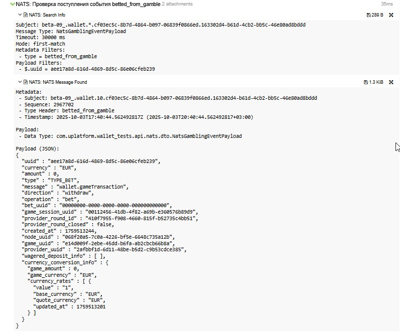
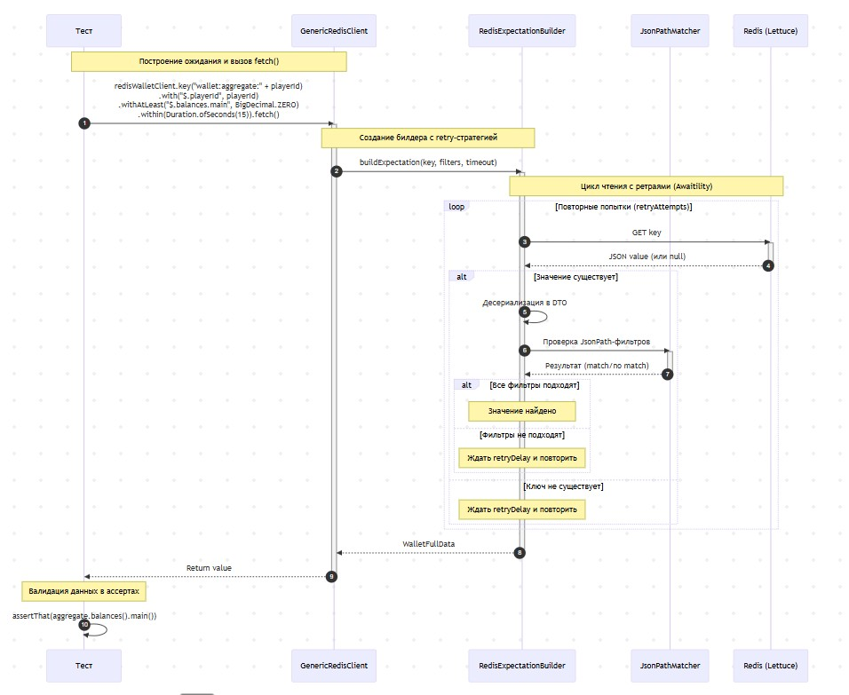
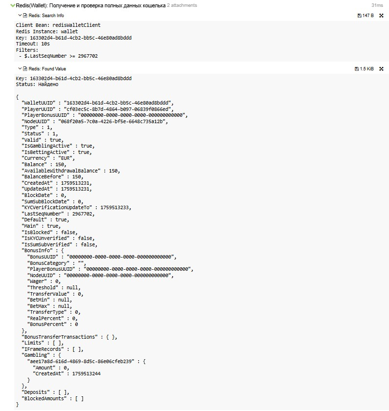
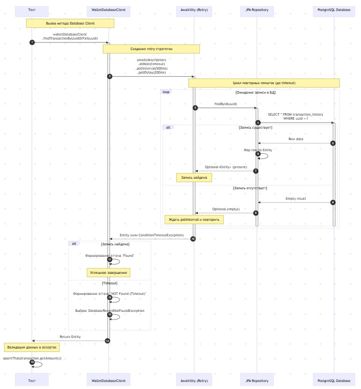
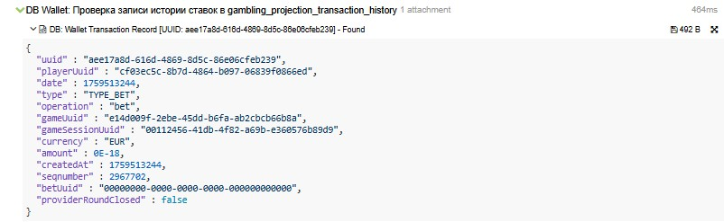

# multi-source-test-client

Универсальный тестовый модуль для интеграции с внешними системами: **HTTP API**, **Kafka**, **NATS**, **Redis** и **Database** (multi-datasource).

## Почему multi-source-test-client?

Модуль предоставляет единый подход к работе с различными источниками данных в автотестах, устраняя необходимость писать boilerplate-код для каждой интеграции:

- **Единый fluent DSL** — однородный API для ожидания данных из любого источника (`.expect()`, `.with()`, `.fetch()`)
- **Централизованная конфигурация** — все параметры подключений и таймаутов в JSON/YAML, переключение между окружениями без правок кода
- **Автоматическая интеграция с Allure** — каждый запрос формирует детальные аттачи (Search Info, Found/Not Found, Errors)
- **Retry-стратегии из коробки** — Awaitility для БД/Redis, polling для Kafka/NATS, игнорирование транзиентных ошибок
- **Multi-datasource поддержка** — работа с несколькими базами данных в одном тесте с изоляцией транзакций
- **Type-safe API** — статическая типизация через Spring Data JPA, Feign-интерфейсы и generic-типы
- **Connection pooling** — HikariCP для БД, OkHttp для HTTP, переиспользование соединений без ручной настройки
- **Многопоточное выполнение** — thread-safe клиенты с буферизацией событий, параллельное выполнение тестов без блокировок

**Результат:** вместо 50-100 строк кода на интеграцию — 5-10 строк декларативного DSL. Фокус на бизнес-логике тестов, а не на технических деталях подключений.

**Производительность:** благодаря многопоточности и переиспользованию соединений, модуль позволяет прогонять огромное количество тестов за считанные минуты. Например, **550 автотестов выполняются за 2 минуты** при параллельном запуске.

---

## Быстрый старт

### Подключение модуля

Добавьте зависимость в `build.gradle`:

```gradle
dependencies {
    testImplementation project(":multi-source-test-client")
}
```

### Минимальная конфигурация

Создайте файл `configs/local.json` с параметрами всех клиентов:

```json
{
  "name": "local",
  "http": {
    "defaults": {
      "baseUrl": "https://localhost:8080"
    },
    "services": {
      "fapi": {
        "baseUrl": "https://localhost:8080"
      }
    }
  },
  "kafka": {
    "bootstrapServer": "localhost:9092",
    "groupId": "wallet-tests-consumer",
    "bufferSize": 500,
    "findMessageTimeout": "PT20S",
    "autoOffsetReset": "latest"
  },
  "nats": {
    "hosts": ["nats://localhost:4222"],
    "streamName": "wallet-events",
    "searchTimeoutSeconds": 30,
    "subscriptionBufferSize": 256
  },
  "databases": {
    "wallet": {
      "host": "localhost",
      "port": 3306,
      "username": "wallet_user",
      "password": "password",
      "retryTimeoutSeconds": 20,
      "retryPollIntervalMs": 500,
      "retryPollDelayMs": 200
    }
  },
  "redis": {
    "aggregate": {
      "maxGamblingCount": 50,
      "retryAttempts": 20,
      "retryDelayMs": 500
    },
    "clients": {
      "wallet": {
        "host": "localhost",
        "port": 6379,
        "database": 0,
        "timeout": "5000ms"
      }
    }
  }
}
```

Все параметры подключений, таймаутов и retry-стратегий читаются из JSON. Переключение между окружениями через `-Denv=local/beta/prod`.

В `application.properties` остаются только технические настройки Spring Boot (логирование, Hibernate, Kafka deserializers).

### Пример использования

```java
@SpringBootTest
public class QuickStartTest {

    @Autowired
    private FapiClient fapiClient;
    @Autowired
    private KafkaClient kafkaClient;
    @Autowired
    private NatsClient natsClient;
    @Autowired
    private GenericRedisClient redisWalletClient;
    @Autowired
    private WalletDatabaseClient walletDatabaseClient;

    @Test
    void shouldIntegrateWithAllSystems() {
        // HTTP
        WalletResponse wallet = fapiClient.getWallet(playerId, token);

        // Kafka
        LimitMessage kafkaMsg = kafkaClient.expect(LimitMessage.class)
                .with("playerId", playerId)
                .fetch();

        // NATS
        NatsMessage<Event> natsMsg = natsClient.expect(Event.class)
                .from(subject)
                .with("$.playerId", playerId)
                .fetch();

        // Redis
        WalletData redisData = redisWalletClient.key("wallet:" + playerId)
                .with("$.balance", value -> value != null)
                .fetch();

        // Database
        Transaction dbRecord = walletDatabaseClient
                .findTransactionByUuidOrFail(transactionId);
    }
}
```

Детальная документация по каждому клиенту доступна ниже в соответствующих секциях.

---

## Оглавление

- [HTTP Test Client](#http-test-client)
  - [Архитектура](#архитектура)
  - [Подключение и конфигурация](#подключение-и-конфигурация)
  - [Использование](#использование)
  - [Интеграция с Allure](#интеграция-с-allure)
- [Kafka Test Client](#kafka-test-client)
  - [Архитектура](#архитектура-1)
  - [Подключение и конфигурация](#подключение-и-конфигурация-1)
    - [DTO и сопоставление топиков](#dto-и-сопоставление-топиков)
    - [Spring-конфигурация реестра топиков](#spring-конфигурация-реестра-топиков)
    - [Настройки приложения](#настройки-приложения)
  - [Сценарии использования](#сценарии-использования)
    - [Методы fluent API](#методы-fluent-api)
    - [Комплексный пример](#комплексный-пример)
  - [Интеграция с Allure](#интеграция-с-allure-1)
- [NATS Test Client](#nats-test-client)
  - [Архитектура и ключевые компоненты](#архитектура-и-ключевые-компоненты)
  - [Подключение и конфигурация](#подключение-и-конфигурация-2)
    - [Файл окружения](#файл-окружения)
    - [Настройки клиента](#настройки-клиента)
  - [Сценарии использования](#сценарии-использования-1)
    - [Методы fluent API](#методы-fluent-api-1)
    - [Комплексный пример](#комплексный-пример-1)
  - [Интеграция с Allure](#интеграция-с-allure-2)
- [Redis Test Client](#redis-test-client)
  - [Архитектура и ключевые компоненты](#архитектура-и-ключевые-компоненты-1)
  - [Подключение и конфигурация](#подключение-и-конфигурации-3)
    - [Spring-конфигурация типов](#spring-конфигурация-типов)
    - [Настройки клиента](#настройки-клиента-1)
  - [Сценарии использования](#сценарии-использования-2)
    - [Методы fluent API](#методы-fluent-api-2)
    - [Комплексный пример](#комплексный-пример-2)
  - [Интеграция с Allure](#интеграция-с-allure-3)
- [Database Test Client](#database-test-client)
  - [Архитектура](#архитектура-4)
  - [Подключение и конфигурация](#подключение-и-конфигурация-4)
    - [Настройки приложения](#настройки-приложения-1)
    - [Spring-конфигурация источников данных](#spring-конфигурация-источников-данных)
  - [Использование](#использование-1)
    - [Создание Entity и Repository](#создание-entity-и-repository)
    - [Реализация Database Client](#реализация-database-client)
    - [Использование в тестах](#использование-в-тестах-1)
  - [Интеграция с Allure](#интеграция-с-allure-4)

---

## HTTP Test Client

HTTP-клиент из модуля `kafka-api` работает поверх **Spring Cloud OpenFeign** и **OkHttp**, предоставляя декларативный способ
описания REST API через интерфейсы. Конфигурация читается из единых JSON-файлов окружений, автоматически регистрируется в
Spring properties и не требует правок в `application.yml` при переключении стендов.

### Архитектура

Высокоуровневый обмен между тестом, Feign-клиентом и HTTP API выглядит так:



### Ключевые компоненты

- **OpenFeign** — декларативный HTTP-клиент через аннотации, маппинг методов на HTTP-запросы.
- **OkHttp** — транспортный слой с connection pooling (10 соединений, 5 минут keep-alive по умолчанию).
- **DynamicPropertiesConfigurator** — автоматически регистрирует все сервисы из JSON как Spring properties (`${app.api.<service>.*}`).
- **HttpServicesProperties** — читает блок `http` из конфигурации и прокидывает настройки в property source.
- **FeignLogger** — логирует запросы и ответы с уровнем `FULL`, формируя детальные аттачи для Allure.

### Подключение и конфигурация

Блок `http` в `configs/<env>.json` содержит глобальные defaults и карту сервисов:

```json
{
  "http": {
    "defaults": {
      "baseUrl": "https://beta-09.b2bdev.pro",
      "concurrency": {
        "requestTimeoutMs": 5000,
        "defaultRequestCount": 2
      }
    },
    "services": {
      "fapi": {
        "baseUrl": "https://beta-09.b2bdev.pro"
      },
      "cap": {
        "baseUrl": "https://cap.beta-09.b2bdev.pro"
      },
      "payment": {
        "baseUrl": "https://payment.beta-09.b2bdev.pro",
        "timeout": 10000
      }
    }
  }
}
```

**Автоматическая регистрация:** любой сервис из `http.services.*` становится доступен как `${app.api.<service-name>.*}`

Примеры:
```
http.services.fapi.baseUrl    → ${app.api.fapi.base-url}
http.services.cap.baseUrl     → ${app.api.cap.base-url}
http.services.payment.baseUrl → ${app.api.payment.base-url}
http.services.payment.timeout → ${app.api.payment.timeout}
```

Дополнительные атрибуты (например, `timeout`, `username`, `password`) конвертируются из camelCase в kebab-case и доступны через
те же Spring properties.

- `defaults.baseUrl` — базовый URL для всех сервисов, не имеющих собственного `baseUrl`.
- `defaults.concurrency.requestTimeoutMs` — глобальный таймаут запросов (используется вспомогательными хелперами).
- `defaults.concurrency.defaultRequestCount` — количество параллельных запросов по умолчанию для bulk-сценариев.
- `services.<name>.baseUrl` — полный URL сервиса; переопределяет глобальный `defaults.baseUrl`.
- `services.<name>.timeout` — таймаут в миллисекундах для конкретного сервиса; если не указан, используется `60000ms` (read/write timeout OkHttp).

### Использование

#### Создание Feign клиента

Описываете интерфейс с аннотациями Spring MVC, ссылаясь на property из конфигурации:

```java
package com.uplatform.wallet_tests.api.http.clients;

import org.springframework.cloud.openfeign.FeignClient;
import org.springframework.web.bind.annotation.*;

@FeignClient(name = "fapiClient", url = "${app.api.fapi.base-url}")
public interface FapiClient {

    @GetMapping("/api/v1/wallets/{playerId}")
    WalletResponse getWallet(@PathVariable("playerId") String playerId,
                              @RequestHeader("Authorization") String authToken);

    @PostMapping("/api/v1/transactions")
    TransactionResponse createTransaction(@RequestBody TransactionRequest request,
                                           @RequestHeader("X-Request-Id") String requestId);
}
```

Feign автоматически сериализует `@RequestBody` в JSON и десериализует тело ответа в указанный тип.

#### Активация клиентов

Добавьте `@EnableFeignClients` в Spring-конфигурацию тестов, указав пакет, в котором лежат интерфейсы:

```java
@Configuration
@EnableFeignClients(basePackages = "com.uplatform.wallet_tests.api.http.clients")
public class TestHttpConfig {
}
```

Spring автоматически создаёт бины-прокси для всех найденных `@FeignClient` интерфейсов.

#### Использование в тестах

Внедряете клиент через `@Autowired` и вызываете методы в Allure-steps:

```java
@SpringBootTest
public class WalletHttpApiTest {

    @Autowired
    private FapiClient fapiClient;

    @Test
    void shouldGetWalletAndCreateTransaction() {
        String playerId = "test-player-123";
        String token = "Bearer " + generateTestToken();

        step("HTTP: Получение кошелька игрока", () -> {
            WalletResponse wallet = fapiClient.getWallet(playerId, token);
            assertThat(wallet.getBalance()).isGreaterThanOrEqualTo(BigDecimal.ZERO);
        });

        step("HTTP: Создание транзакции", () -> {
            TransactionRequest request = new TransactionRequest(playerId, BigDecimal.TEN, "BET");
            TransactionResponse response = fapiClient.createTransaction(request, UUID.randomUUID().toString());
            assertThat(response.getStatus()).isEqualTo("SUCCESS");
        });
    }
}
```

Feign автоматически подставляет `baseUrl` из property, добавляет заголовки и обрабатывает ошибки согласно статусу HTTP.

---

### Интеграция с Allure

`FeignLogger` с уровнем `FULL` логирует каждый запрос и ответ:

- **Request** — HTTP-метод, URL, заголовки, тело запроса.
- **Response** — статус, заголовки, тело ответа, время выполнения.
- **Error** — при статусах 4xx/5xx или сетевых ошибках логирует исключение и payload.

Логи автоматически прикрепляются к текущему Allure-step, формируя подробный отчёт для каждого HTTP-взаимодействия.

Пример того, как это выглядит в Allure:


---

## Kafka Test Client

Kafka-клиент из модуля `kafka-api` помогает автотестам находить события в нужных топиках, ждать их появления и
прикладывать подробные артефакты в Allure. Он работает асинхронно, потокобезопасен и интегрируется со Spring Boot
через стандартные бины конфигурации.

### Архитектура

Высокоуровневый обмен между тестом, клиентом и Kafka выглядит так:



---

## Подключение и конфигурация

Чтобы подключить Kafka-клиент в тестовом проекте:

1. Добавьте модуль `kafka-api` в тестовые зависимости Gradle.
2. Опишите DTO для сообщений и зарегистрируйте сопоставление DTO → топик в `KafkaTopicMappingRegistry`.
3. Настройте параметры Kafka в окруженческих JSON-файлах.

### DTO и сопоставление топиков

Создайте `record`, который отражает схему сообщения и будет десериализовываться клиентом:

```java
package com.uplatform.wallet_tests.api.kafka.dto;

public record BonusAwardMessage(
        String playerId,
        String bonusId,
        String status,
        long sequence
) {}
```

Затем зарегистрируйте DTO в `KafkaTopicMappingRegistry`, чтобы фоновые listener'ы подписались на нужный топик (см.
пример ниже).

### Spring-конфигурация реестра топиков

Создайте бин `KafkaTopicMappingRegistry`, который сопоставляет DTO и суффиксы топиков:

```java
@Configuration
public class KafkaConsumerConfig {

    @Bean
    public KafkaTopicMappingRegistry kafkaTopicMappingRegistry() {
        Map<Class<?>, String> mappings = new HashMap<>();
        mappings.put(BonusAwardMessage.class, "bonus.v1.award");
        // другие сопоставления
        return new SimpleKafkaTopicMappingRegistry(mappings);
    }
}
```

Реестр гарантирует, что фоновые listener'ы подпишутся на каждый указанный топик автоматически — ничего дополнительно
в `application.yml` прописывать не нужно.

### Настройки приложения

Фрагмент `configs/local.json`, который покрывает основные параметры клиента:

```json
{
  "kafka": {
    "bootstrapServer": "kafka-development-01:9092,kafka-development-02:9092,kafka-development-03:9092",
    "groupId": "wallet-tests-consumer",
    "bufferSize": 500,
    "findMessageTimeout": "PT60S",
    "findMessageSleepInterval": "PT0.2S",
    "pollDuration": "PT1S",
    "shutdownTimeout": "PT5S",
    "autoOffsetReset": "latest",
    "enableAutoCommit": true
  }
}
```

Все параметры читаются через `KafkaProperties` и автоматически прокидываются в `KafkaClient` через Spring. Изменяйте их
в JSON-конфигах окружений, чтобы не править код при переключении между стендами.

- `topicPrefix` задаётся в `EnvironmentConfig.topicPrefix`. Добавляется ко всем Kafka-топикам, например `wallet.beta.`.
- `bootstrapServer` в блоке `kafka.bootstrapServer` перечисляет брокеры, к которым подключается consumer: `kafka-dev-01:9092,kafka-dev-02:9092`.
- `groupId` (`kafka.groupId`) — идентификатор consumer group для всех автотестов, например `wallet-tests-consumer`.
- `bufferSize` (`kafka.bufferSize`) ограничивает количество сообщений на топик в буфере. Типичное значение — `500`.
- `findMessageTimeout` (`kafka.findMessageTimeout`) задаёт таймаут ожидания для `fetch()` по умолчанию, например `PT20S`.
- `findMessageSleepInterval` (`kafka.findMessageSleepInterval`) определяет паузу между попытками поиска сообщения, например `PT0.2S`.
- `pollDuration` (`kafka.pollDuration`) описывает максимальную блокировку вызова `poll` у consumer'а, обычно `PT1S`.
- `shutdownTimeout` (`kafka.shutdownTimeout`) — время на корректное завершение consumer при остановке тестов, например `PT5S`.
- `autoOffsetReset` (`kafka.autoOffsetReset`) регулирует поведение при отсутствии offset'ов (`latest` или `earliest`).
- `enableAutoCommit` (`kafka.enableAutoCommit`) включает автоматический коммит offset'ов, чаще всего `true`.

## Сценарии использования

### Методы fluent API

- `kafkaClient.expect(Class<T>)` — вызывается на бине `KafkaClient`, стартует построение ожидания для указанного DTO и
  подхватывает таймаут по умолчанию из конфигурации.
- `.with(String key, Object value)` — вызывается на билдере, добавляет JsonPath-фильтр. Значение сериализуется в `String`,
  `null` и пустые строки игнорируются, вложенные поля описываются как `data.player.id` или `$.path.to.field`.
- `.unique()` — включает проверку уникальности события в буфере. При нарушении будет выброшено
  `KafkaMessageNotUniqueException`, при отсутствии подходящего сообщения — `KafkaMessageNotFoundException`.
- `.within(Duration timeout)` — переопределяет таймаут ожидания только для текущего запроса. Подходит для ускоренных или
  долгих сценариев без изменения глобальной настройки.
- `.fetch()` — выполняет поиск сообщения и возвращает десериализованный DTO, формируя Allure-аттачи даже при таймауте или
  ошибке десериализации.

Комбинируйте методы цепочкой, чтобы описать нужное ожидание. Фильтры применяются одновременно, поэтому событие должно
удовлетворять всем заданным условиям.

### Комплексный пример

```java
step("Kafka: Получение сообщения из топика limits.v2", () -> {
    var expectedAmount = initialAmount.stripTrailingZeros().toPlainString();
    LimitMessage kafkaLimitMessage = kafkaClient.expect(LimitMessage.class)
            .with("playerId", registeredPlayer.getWalletData().playerUUID())
            .with("limitType", NatsLimitType.SINGLE_BET.getValue())
            .with("currencyCode", registeredPlayer.getWalletData().currency())
            .with("amount", expectedAmount)
            .fetch();

    assertNotNull(kafkaLimitMessage, "kafka.limits_v2_event.message_not_null");
});
```

Комбинируйте `.unique()` и `within(...)`, чтобы гибко управлять проверками и таймаутами.

---

## Интеграция с Allure

При каждом поиске клиент формирует аттачи:

- **Search Info** — условия поиска (топик, DTO, фильтры, таймаут).
- **Found Message** — форматированное тело найденного события, partition, offset и timestamp.
- **Message Not Found** — отчёт о таймауте и несостоявшемся поиске.
- **Deserialization Error** — подробности ошибки Jackson и исходный payload.

Пример того, как это выглядит в Allure:

---

## NATS Test Client

Клиент NATS в модуле `kafka-api` работает поверх JetStream, повторяя знакомый по Kafka и Redis подход: ожидания описываются через
fluent API, параметры читаются из единого JSON-конфига, а результат сопровождается аттачами в Allure.

### Архитектура

Высокоуровневый обмен между тестом, клиентом и NATS JetStream выглядит так:



### Ключевые компоненты

- **`NatsClient`.** Фасад, который собирает ожидание (`expect(...)`) и делегирует поиск в `NatsSubscriber`.
- **`NatsSubscriber`.** Управляет JetStream-подпиской в отдельном dispatcher'е, применяет фильтры и следит за таймаутами.
- **`NatsPayloadMatcher`.** Сравнивает payload по JSONPath-выражениям и метаданным сообщения.
- **`NatsAttachmentHelper`.** Формирует единый набор аттачей: Search Info, Found Message, Duplicate Message и Message Not Found.
- **`NatsConnectionManager`.** Настраивает подключение и кэширует `Connection`/`JetStream` на время тестового прогона.

Такое разделение повторяет паттерн Kafka-клиента, поэтому интеграция с тестами и Spring остаётся однородной.

### Подключение и конфигурация


#### Файл окружения

`EnvironmentConfigurationProvider` читает JSON `configs/<env>.json` (значение передаётся через `-Denv=...`) и прокидывает блок
`nats` в `NatsConfigProvider`:

```json
{
  "name": "beta",
  "natsStreamPrefix": "beta_",
  "nats": {
    "hosts": ["nats://nats-1:4222", "nats://nats-2:4222"],
    "streamName": "wallet-events",
    "subscriptionRetryCount": 3,
    "subscriptionRetryDelayMs": 500,
    "connectReconnectWaitSeconds": 2,
    "connectMaxReconnects": 10,
    "searchTimeoutSeconds": 30,
    "subscriptionAckWaitSeconds": 5,
    "subscriptionInactiveThresholdSeconds": 60,
    "subscriptionBufferSize": 256,
    "uniqueDuplicateWindowMs": 400,
    "failOnDeserialization": true
  }
}
```

Полное имя стрима формируется как `natsStreamPrefix + streamName`; хелпер `buildWalletSubject(...)` дополнительно добавляет
окруженческий префикс и wildcard-сегмент для канала.

#### Настройки клиента

- `hosts` (`nats.hosts`) — список URL JetStream-кластера, к которым подключается клиент.
- `streamName` (`nats.streamName`) — базовое имя стрима без окруженческого префикса; окружение добавляется через `natsStreamPrefix`.
- `subscriptionRetryCount` / `subscriptionRetryDelayMs` (`nats.subscriptionRetryCount` / `nats.subscriptionRetryDelayMs`) — количество попыток создания подписки и пауза между ними.
- `connectReconnectWaitSeconds` / `connectMaxReconnects` (`nats.connectReconnectWaitSeconds` / `nats.connectMaxReconnects`) — стратегия переподключений при потере соединения.
- `searchTimeoutSeconds` (`nats.searchTimeoutSeconds`) — таймаут ожидания сообщения по умолчанию; метод `.within(...)` переопределяет его локально.
- `subscriptionAckWaitSeconds` / `subscriptionInactiveThresholdSeconds` (`nats.subscriptionAckWaitSeconds` / `nats.subscriptionInactiveThresholdSeconds`) — таймауты ack и неактивности JetStream-подписки.
- `subscriptionBufferSize` (`nats.subscriptionBufferSize`) — размер буфера сообщений на подписку в памяти клиента.
- `uniqueDuplicateWindowMs` (`nats.uniqueDuplicateWindowMs`) — окно, в пределах которого работает контроль дублей для `.unique()`.
- `failOnDeserialization` (`nats.failOnDeserialization`) — при значении `true` ожидание завершается ошибкой, если payload нельзя десериализовать.

## Сценарии использования

### Методы fluent API

NATS-DSL полностью перешёл на JSONPath- и metadata-фильтры, повторяя подход Kafka-клиента и делая поиск сообщений детерминированным.

- `natsClient.expect(Class<T>)` — стартует построение ожидания для DTO и подхватывает таймаут по умолчанию из конфигурации.
- `.from(String subject)` — задаёт subject JetStream, с которого нужно читать события. Хелпер `buildWalletSubject(...)` помогает формировать его из идентификаторов игрока/кошелька.
- `.with(String jsonPath, Object value)` — добавляет JSONPath-фильтр к payload. Значение сериализуется в строку; `null` и пустые строки игнорируются. Можно комбинировать выражения любой вложенности: `$.playerId`, `$.data.limit.amount`, `data.balance`.
- `.withType(String type)` — проверяет metadata-поле `type`, удобно для разграничения событий одного DTO.
- `.withSequence(long sequence)` — фиксирует ожидаемый порядковый номер сообщения в стриме.
- `.unique()` — включает контроль дублей, используя окно `uniqueDuplicateWindowMs` из конфигурации.
- `.unique(Duration window)` — задаёт собственное окно для поиска дублей; повторяющиеся сообщения приводят к `NatsDuplicateMessageException` и отдельному аттачу.
- `.within(Duration timeout)` — переопределяет таймаут ожидания только для текущего запроса.
- `.fetch()` — выполняет поиск сообщения, возвращает `NatsMessage<T>` и формирует аттачи даже при таймауте или ошибке.

Все фильтры применяются одновременно, поэтому сообщение должно удовлетворять каждому условию сразу.

### Комплексный пример

```java
step("NATS: Получаем событие о создании лимита", () -> {
    String subject = natsClient.buildWalletSubject(playerId.toString(), walletId.toString());

    NatsMessage<WalletLimitEvent> message = natsClient.expect(WalletLimitEvent.class)
            .from(subject)
            .with("$.playerId", playerId.toString())
            .with("$.limitType", expectedLimitType)
            .withType("LimitCreatedEvent")
            .withSequence(expectedSequence)
            .unique(Duration.ofSeconds(5))
            .within(Duration.ofSeconds(30))
            .fetch();

    assertThat(message.getPayload().limitType()).isEqualTo(expectedLimitType);
});
```

Комбинируйте `.unique()` и `within(...)`, чтобы гибко управлять таймаутами и проверкой дублей.

### Интеграция с Allure

Каждый поиск формирует единый набор вложений:

- **Search Info** — subject, таймаут, тип DTO и полный список JSONPath/metadata-фильтров.
- **Found Message** — форматированный payload с метаданными JetStream.
- **Duplicate Message** — появляется при нарушении `.unique()`.
- **Message Not Found** — содержит информацию о таймауте и применённых фильтрах.

Пример того, как это выглядит в Allure:


---

## Redis Test Client

Redis-клиент из `kafka-api` повторяет знакомую структуру Kafka- и NATS-модулей: fluent DSL описывает ожидание значения по ключу,
конфигурация хранится во внешних JSON/YAML файлах, а результат сопровождён информативными аттачами в Allure.

### Архитектура

Высокоуровневый обмен между тестом, клиентом и Redis выглядит так:



### Ключевые компоненты

- **`GenericRedisClient`.** Точечный бин для каждого инстанса, разворачиваемого из конфигурации. Инициализирует билдер ожидания через
  `.key(...)` и прокидывает типы/зависимости.
- **`RedisExpectationBuilder`.** Fluent API, который применяет JsonPath-фильтры, управляет таймаутом и формирует отчёт об успешном
  чтении или таймауте.
- **`RedisTypeMappingRegistry`.** Реестр `TypeReference`, связывающий логические имена клиентов (`wallet`, `player`) с DTO для
  десериализации ответа.
- **`RedisAwaitilityProperties`.** Настройки повторных попыток (`retryAttempts`, `retryDelay`) и таймаутов, используемые по
  умолчанию билдером.

### Подключение и конфигурация


#### Spring-конфигурация типов

Опишите бин `RedisTypeMappingRegistry`, чтобы модули тестов получили типобезопасный доступ к значениям:

```java
@Configuration
public class RedisConfig {

    @Bean
    public RedisTypeMappingRegistry redisTypeMappingRegistry() {
        return new RedisTypeMappingRegistry()
                .register("wallet", new TypeReference<WalletFullData>() {})
                .register("player", new TypeReference<Map<String, WalletData>>() {});
    }
}
```

Каждый блок `clients.<name>` из конфигурации разворачивается в бин `redis<Имя>Client`, поэтому `clients.wallet` создаёт
`redisWalletClient`, а `clients.player` — `redisPlayerClient`.

#### Настройки клиента

Блок `redis` в `configs/<env>.json` управляет ретраями, подключениями и пулами Lettuce:

```json
{
  "redis": {
    "aggregate": {
      "maxGamblingCount": 50,
      "maxIframeCount": 500,
      "retryAttempts": 20,
      "retryDelayMs": 500
    },
    "clients": {
      "wallet": {
        "host": "redis-01.b2bdev.pro",
        "port": 6390,
        "database": 9,
        "timeout": "5000ms",
        "password": "secret",
        "lettucePool": {
          "maxActive": 8,
          "maxIdle": 8,
          "minIdle": 0,
          "maxWait": "2s",
          "shutdownTimeout": "100ms"
        }
      },
      "player": {
        "host": "redis-01.b2bdev.pro",
        "port": 6389,
        "database": 9,
        "timeout": "5s"
      }
    }
  }
}
```

- `aggregate.retryAttempts` / `aggregate.retryDelayMs` — количество повторов чтения и задержка между ними для Awaitility.
- `aggregate.maxGamblingCount` / `aggregate.maxIframeCount` — границы агрегатов, которые используют вспомогательные хелперы тестов.
- `clients.<name>` — описание Redis-инстанса и имя создаваемого бина `redis<Имя>Client`.
- `timeout` — таймаут операций Lettuce; поддерживаются ISO 8601 (`PT5S`) и значения с суффиксами (`5000ms`).
- `password` — опциональный пароль для подключения.
- `lettucePool.*` — параметры пула: лимиты активных/свободных подключений, ожидание и таймаут завершения.

### Сценарии использования

#### Методы fluent API

- `redis<Имя>Client.key(String key)` — стартует ожидание для конкретного ключа, проверяя, что он не пустой.
- `.with(String jsonPath, Object value)` — сравнивает значение JsonPath с ожидаемым, корректно обрабатывая числа и строки.
- `.with(String jsonPath, Predicate<Object> predicate)` / `.with(..., String description)` — позволяет описать произвольное условие и
  человекочитаемое описание, которое попадёт в аттач.
- `.withAtLeast(String jsonPath, Number threshold)` — проверяет, что числовое значение не меньше порога.
- `.within(Duration timeout)` — переопределяет таймаут только для текущего запроса; иначе используется значение из
  `RedisAwaitilityProperties`.
- `.fetch()` — выполняет чтение с ретраями, возвращает десериализованный DTO и формирует аттачи для Allure.

Фильтры применяются одновременно: значение должно удовлетворять каждому JsonPath-условию, чтобы запрос завершился успехом.

#### Комплексный пример

```java
step("Redis: Проверяем агрегат кошелька и связанный кеш", () -> {
    WalletFullData aggregate = redisWalletClient.key("wallet:aggregate:" + playerId)
            .with("$.playerId", playerId)
            .with("$.metadata.environment", environmentCode)
            .withAtLeast("$.balances.main", BigDecimal.ZERO)
            .with("$.limits", value -> !((Collection<?>) value).isEmpty(), "contains at least one limit")
            .within(Duration.ofSeconds(15))
            .fetch();

    Map<String, WalletData> wallets = redisPlayerClient.key("player:wallets:" + playerId)
            .with("$.entries['" + playerId + "'].currency", aggregate.balances().currency())
            .fetch();

    assertNotNull(wallets.get(playerId), "then.redis.player.wallet_present");
});
```

Таймаут и фильтры можно комбинировать в любой последовательности. При истечении времени будет выброшено
`RedisRetryExhaustedException` с подробными причинами последней попытки.

### Интеграция с Allure

Каждый вызов `fetch()` формирует стандартные вложения:

- **Search Info** — имя бина, ключ, таймаут и полный список JsonPath-фильтров.
- **Found Value** — форматированный JSON найденного значения.
- **Value Not Found** — итоговая причина таймаута и фактическое время ожидания.
- **Deserialization Error** — исходный JSON и сообщение Jackson, если десериализация провалилась.

Эти аттачи упрощают анализ Redis-проверок и полностью соответствуют стилю Kafka/NATS клиентов.

Пример того, как это выглядит в Allure:


---

## Database Test Client

Database-клиент из `kafka-api` предоставляет типизированный доступ к данным через Spring Data JPA с поддержкой нескольких источников данных. Клиенты используют Awaitility для ожидания записей в БД, автоматически формируют Allure-аттачи и обрабатывают транзакционные исключения.

### Архитектура

Высокоуровневое взаимодействие между тестом, клиентом и базой данных:



### Ключевые компоненты

- **`AbstractDatabaseClient`** — базовый класс со стратегией retry через Awaitility, обработкой таймаутов и формированием аттачей.
- **`WalletDatabaseClient` / `CoreDatabaseClient` / `PlayerDatabaseClient`** — типизированные клиенты для конкретных баз данных с domain-специфичными методами.
- **Spring Data JPA Repositories** — стандартные репозитории с поддержкой custom queries и projections.
- **Multi-datasource конфигурация** — отдельные `EntityManager`, `TransactionManager` и connection pools для каждой БД.
- **HikariCP** — connection pooling с настройками размера пула, таймаутов и connection test query.

Такая архитектура позволяет работать с несколькими базами данных в рамках одного теста, изолируя транзакции и подключения.

### Подключение и конфигурация


#### Настройки приложения

Блок `databases` в `configs/<env>.json` описывает параметры каждой базы данных:

```json
{
  "databases": {
    "wallet": {
      "host": "mysql-development-01.b2bdev.pro",
      "port": 3306,
      "username": "qa_auto",
      "password": "HoxTNjfnZsGt",
      "retryTimeoutSeconds": 10,
      "retryPollIntervalMs": 100,
      "retryPollDelayMs": 100
    },
    "core": {
      "host": "mysql-development-01.b2bdev.pro",
      "port": 3306,
      "username": "qa_auto",
      "password": "HoxTNjfnZsGt",
      "retryTimeoutSeconds": 10,
      "retryPollIntervalMs": 100,
      "retryPollDelayMs": 100
    },
    "player": {
      "host": "mysql-development-01.b2bdev.pro",
      "port": 3306,
      "username": "qa_auto",
      "password": "HoxTNjfnZsGt",
      "retryTimeoutSeconds": 10,
      "retryPollIntervalMs": 100,
      "retryPollDelayMs": 100
    }
  }
}
```

- `databases.<name>.host` / `databases.<name>.port` — адрес и порт базы данных.
- `databases.<name>.username` / `databases.<name>.password` — учётные данные для подключения.
- `databases.<name>.retryTimeoutSeconds` — максимальное время ожидания записи в БД (по умолчанию 20 секунд).
- `databases.<name>.retryPollIntervalMs` — интервал между попытками чтения (по умолчанию 500 мс).
- `databases.<name>.retryPollDelayMs` — начальная задержка перед первой попыткой (по умолчанию 200 мс).

Дополнительно в `application.properties` задаются технические параметры Spring Data JPA и HikariCP (driver class, hikari pool settings, test query).

#### Spring-конфигурация источников данных

Каждая база данных требует отдельной конфигурации с `@EnableJpaRepositories`:

```java
@Configuration
@EnableTransactionManagement
@EnableJpaRepositories(
        basePackages = "com.uplatform.wallet_tests.api.db.repository.wallet",
        entityManagerFactoryRef = "walletEntityManagerFactory",
        transactionManagerRef = "walletTransactionManager"
)
public class WalletDbConfig extends BaseDbConfig {

    @Bean
    @ConfigurationProperties("spring.datasource.wallet")
    public DataSourceProperties walletDataSourceProperties() {
        return createDataSourceProperties();
    }

    @Bean
    public HikariDataSource walletDataSource(
            @Qualifier("walletDataSourceProperties") DataSourceProperties properties) {
        return createDataSource(properties);
    }

    @Bean
    public LocalContainerEntityManagerFactoryBean walletEntityManagerFactory(
            EntityManagerFactoryBuilder builder,
            @Qualifier("walletDataSource") HikariDataSource dataSource) {
        return createEntityManagerFactory(builder, dataSource,
                "com.uplatform.wallet_tests.api.db.entity.wallet", "wallet");
    }

    @Bean
    public PlatformTransactionManager walletTransactionManager(
            @Qualifier("walletEntityManagerFactory")
            LocalContainerEntityManagerFactoryBean entityManagerFactory) {
        return createTransactionManager(entityManagerFactory);
    }
}
```

Аналогичные конфигурации создаются для `core` и `player` баз данных, меняя только пакеты репозиториев и entity.

### Использование

#### Создание Entity и Repository

Опишите JPA-entity, соответствующую схеме таблицы:

```java
@Entity
@Table(name = "gambling_projection_transaction_history", schema = "wallet")
@Data
public class GamblingProjectionTransactionHistory {

    @Id
    @Column(name = "uuid")
    private String uuid;

    @Column(name = "player_uuid")
    private String playerUuid;

    @Column(name = "amount")
    private BigDecimal amount;

    @Column(name = "currency_code")
    private String currencyCode;

    @Column(name = "transaction_type")
    private String transactionType;

    @Column(name = "created_at")
    private Instant createdAt;
}
```

Создайте Spring Data JPA Repository:

```java
@Repository
public interface GamblingProjectionTransactionHistoryRepository
        extends JpaRepository<GamblingProjectionTransactionHistory, String> {

    Optional<GamblingProjectionTransactionHistory> findById(String uuid);
}
```

#### Реализация Database Client

Расширьте `AbstractDatabaseClient` и добавьте domain-методы:

```java
@Component
public class WalletDatabaseClient extends AbstractDatabaseClient {

    private final GamblingProjectionTransactionHistoryRepository transactionRepository;

    public WalletDatabaseClient(
            AllureAttachmentService attachmentService,
            GamblingProjectionTransactionHistoryRepository transactionRepository) {
        super(attachmentService);
        this.transactionRepository = transactionRepository;
    }

    @Transactional(readOnly = true)
    public GamblingProjectionTransactionHistory findTransactionByUuidOrFail(String uuid) {
        String description = String.format("transaction history record by UUID '%s'", uuid);
        String attachmentNamePrefix = String.format("Wallet Transaction Record [UUID: %s]", uuid);

        Supplier<Optional<GamblingProjectionTransactionHistory>> querySupplier = () ->
                transactionRepository.findById(uuid);

        return awaitAndGetOrFail(description, attachmentNamePrefix, querySupplier);
    }
}
```

#### Использование в тестах

Внедряете клиент через `@Autowired` и вызываете методы в Allure-steps:

```java
@SpringBootTest
public class WalletDatabaseTest {

    @Autowired
    private WalletDatabaseClient walletDatabaseClient;

    @Test
    void shouldFindTransactionInDatabase() {
        String transactionUuid = createTestTransaction();

        step("DB: Ожидание записи транзакции в БД", () -> {
            GamblingProjectionTransactionHistory transaction =
                walletDatabaseClient.findTransactionByUuidOrFail(transactionUuid);

            assertThat(transaction.getAmount()).isEqualByComparingTo(BigDecimal.TEN);
            assertThat(transaction.getTransactionType()).isEqualTo("BET");
        });
    }
}
```

Метод `awaitAndGetOrFail` автоматически:
- Повторяет запрос с интервалом `retry-poll-interval-ms`
- Игнорирует транзиентные исключения Spring Data
- Формирует Allure-аттач при успехе или таймауте
- Выбрасывает `DatabaseRecordNotFoundException` при превышении `retry-timeout-seconds`

---

### Интеграция с Allure

При каждом запросе клиент формирует аттачи:

- **Found** — JSON-представление найденной записи с полным набором полей.
- **NOT Found (Timeout)** — информация о таймауте, описание запроса и время ожидания.
- **Error** — детали неожиданных исключений (тип, сообщение, stack trace).

Все аттачи автоматически прикрепляются к текущему Allure-step с префиксом `[DB]`.

Пример того, как это выглядит в Allure:


---
